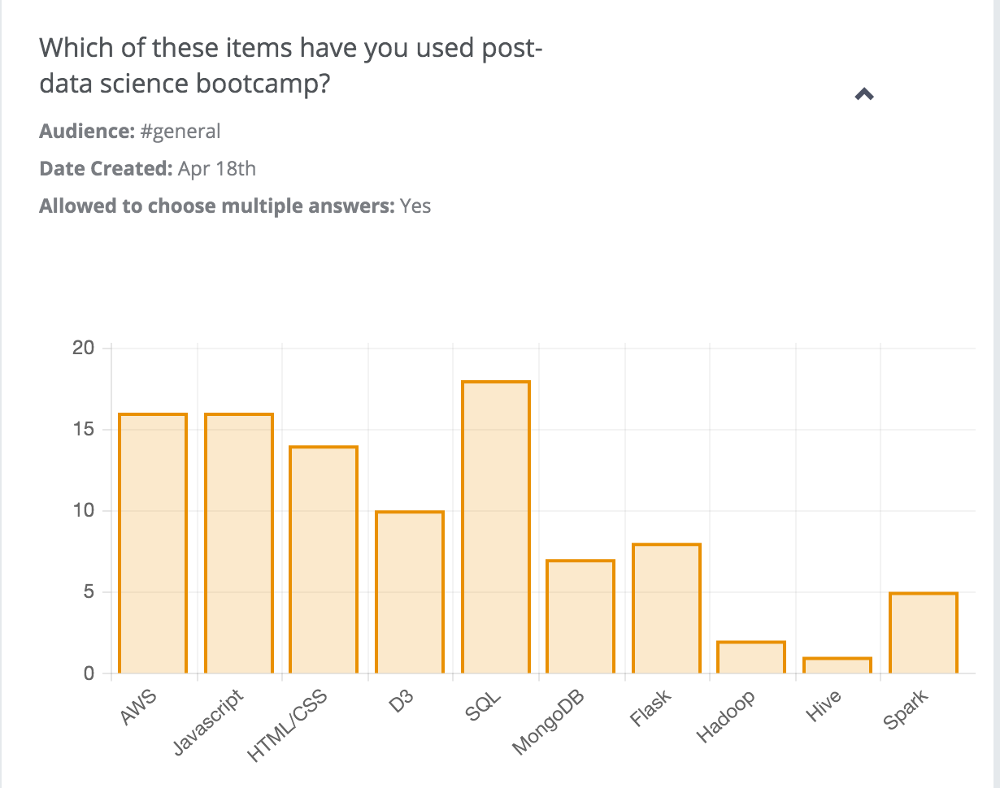

### Amazon Web Services: Preparation for Cloud Computing

1.  Create an AWS account  
  http://aws.amazon.com/  
  **Bookmark it!**  
  (Note:  put your user id and password somewhere for easy reference)
  
2.  **Review command line**   
    You'll need these skills to navigate around the terminal in cloud computing.
    
3.  Frustration Level  
    If you thought Git was technically unwieldy at a level of 1, then setting up AWS cloud server has level 5.
    
4.  How important is it that students learn to set up a virtual machine and navigate the cloud?  
    Below are results from a survey of Metis Data Science Bootcamp alums (n=26).

    
    

