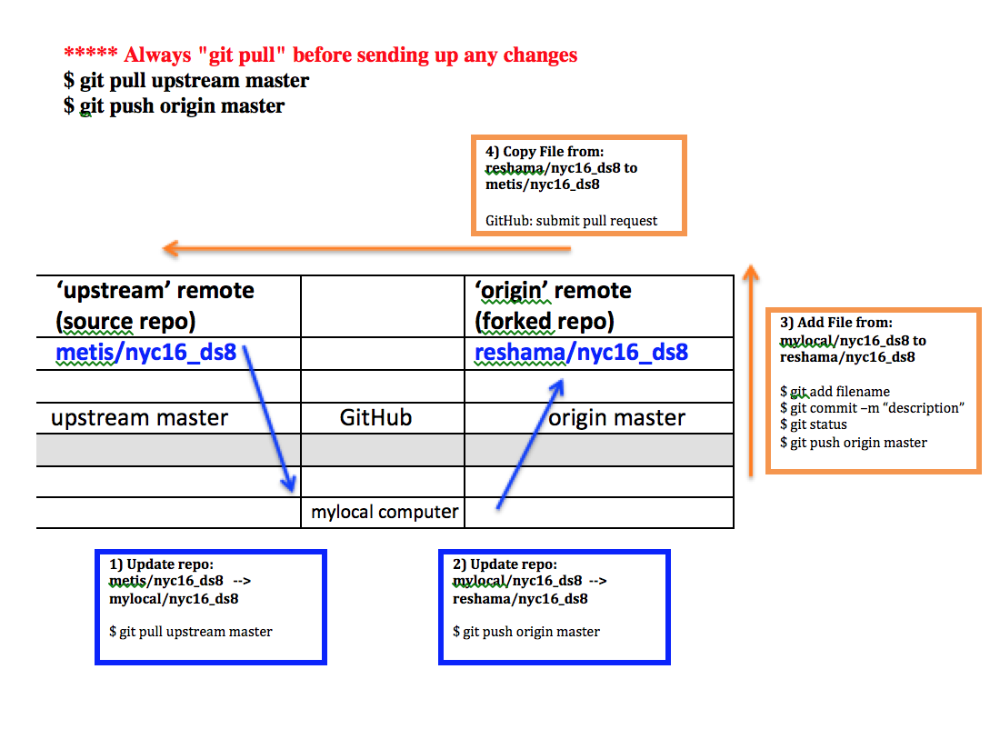

# Git and GitHub

## Objectives

* Create a repo on GitHub for your project and add files to repo
* Fork and clone course repo, set `upstream` remote
* Pull requests
* Branches
* Reset Commit

---

####[Setting up a credential manager (no more login when pushing/pulling)](https://help.github.com/articles/caching-your-github-password-in-git/)

---

 
